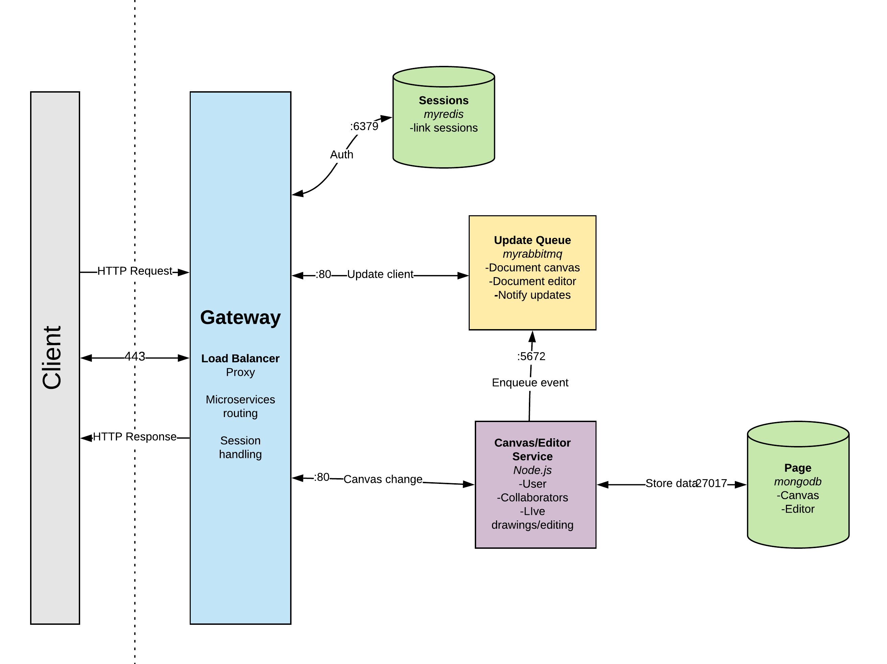

# DCode
## Motivation
Programming often requires brainstorming, drawing out algorithms, and visualizing the code. Especially when one coder is trying to explain his or her logic to others, it’s usually helpful to draw it out. The current collaborative coding solutions, however, only offer services such as live editing code and video chatting. The idea is to help visual-learning coders to have a better experience in collaborative coding environment.
## What
The client-facing DCode platform will be similar to Codeshare or Coderpad but it also has a built-in canvas for users to write/draw scratch work. The right half of the screen will be a code editor while the left half would have the empty canvas. Both the code editor and the canvas will support real-time collaboration among multiple users.
## Architecture


## User Stories
<table>
  <tr>
    <th>Priority</th>
    <th>User</th>
    <th>Description</th>
    <th>Implementation</th>
  </tr>
  <tr>
    <td>P0</td>
    <td>As a user</td>
    <td>I want to create a new DCode page.</td>
    <td>Upon receiving a <b>POST</b> request at <i>v1/pages</i>, the server will create and return a new DCode page, generate a unique page URL, insert the new page in the DB, create a new Redis session and opens a  new <b>websocket</b>.</td>
  </tr>
  <tr>
    <td>P0</td>
    <td>As a user</td>
    <td>I want to open a DCode page URL shared by peers.</td>
    <td>Upon receiving a <b>GET</b> request to <i>v1/pages/{pageID}</i>, the server opens a <b>websocket</b> connection, adds the user’s unique identifier to the <i>Redis session state</i> and resets the expiration time.</td>
  </tr>
  <tr>
    <td>P0</td>
    <td>As a user</td>
    <td>I want to see real-time updates on my DCode page.</td>
    <td>Upon receiving a <b>GET</b> request to <i>v1/pages/{pageID}</i>, the server opens a websocket connection, adds the user’s unique identifier to the Redis session state and resets the expiration time.</td>
  </tr>
  <tr>
    <td>P0</td>
    <td>As a user</td>
    <td>I want to draw an image on an existing DCode page.</td>
    <td>Upon receiving a <b>PATCH</b> request to the <i>v1/pages/{pageID}</i>, the server updates the page content in the database, and it pushes a new message to the <b>RabbitMQ</b>.</td>
  </tr>
  <tr>
    <td>P0</td>
    <td>As a user</td>
    <td>I want to clear the canvas on an existing DCode page.</td>
    <td>Upon receiving a <b>DELETE</b> request, the server will remove all figures in the database and RabbitMQ </td>
  </tr>
  <tr>
    <td>P1</td>
    <td>As a user</td>
    <td>I would like to choose a programming language for my DCode page.</td>
    <td>Upon receiving a <b>PATCH</b> request to <i>v1/pages/{pageID}/settings</i> endpoint, the server stores the settings in the database.</td>
  </tr>
</table>


## API Reference
**POST /v1/pages**

Creates a new page with a unique URL and responds with the DCode page object. The request body is type `application/json`
- **201**: Successfully created page. Respond with JSON.
- **404**: Page not found. Respond with text.

**GET v1/pages/{pageID}**

Request includes the pageID as a query parameter `id`; Responds with figures and code associated with the specific page ID encoded as `application/json`.
- **200**: status OK. Respond with JSON.
- **404**: DCode page with unique ID does not exist. Respond with error text.

**PATCH v1/pages/{pageID}/canvas**

Updates the DCode page with the given ID. The request body should be of type `application/json`, with an `edit` field containing the new `figures` coordinates.
- **200**: Successfully updated canvas. Respond with JSON.
- **404**: Page no longer exists. Respond with error text.

**DELETE v1/pages/{pageID}/canvas**

Deletes the DCode canvas contents at pageID from the database and responds with a status of 200 and a plain text message: `canvas cleared`
- **200**: Successfully deleted canvas contents. Respond with text.
- **404**: Page no longer exists. Response with text.

**PATCH v1/pages/{pageID}/editor**

Updates existing editor in mongo page object
- **200**: Successfully applied changes to editor. Respond with JSON.
- **404**: Page no longer exists. Respond with text.

## MongoDB Models
### Page Schema
```javascript
{
  _id: Schema.Types.ObjectID,
  figures: [],
  code: [],  
  createdAt: Time,  
  lastEdited: Time,  
}
```

## Redis Store
### Session Store
```javascript
type SessionStore struct {  
    Client,  
	SessionDuration,  
}
```
### Session State
```javascript
type SessionState struct {  
    SessionBegin,  
    users,  
}
```

### Redis Key Value Pairs
**Key:** Randomly generated hash which forms the unique link for the page.  
**Value:** IP Addresses.
